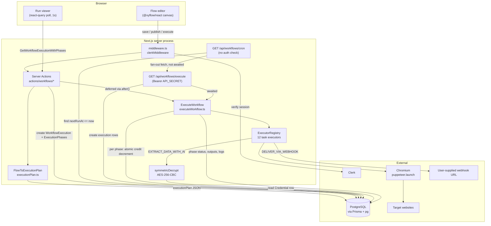
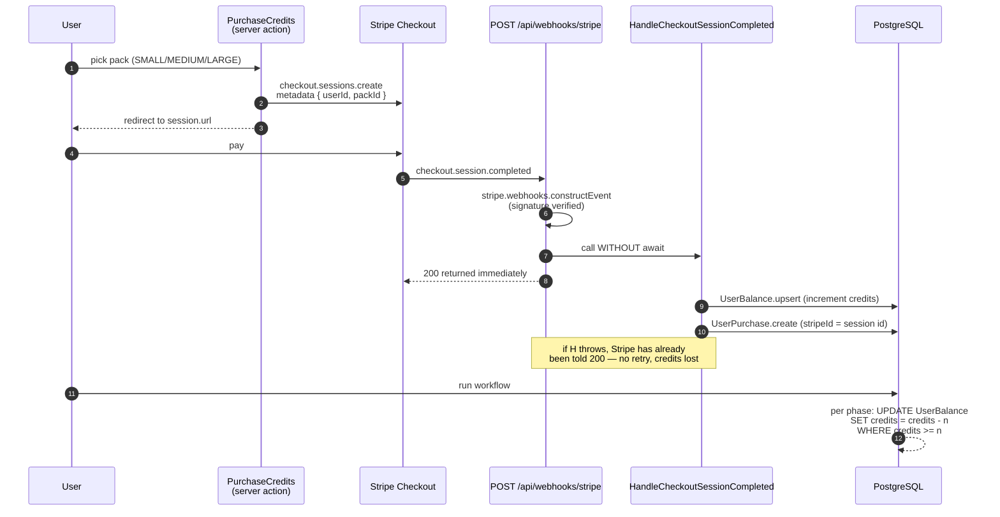
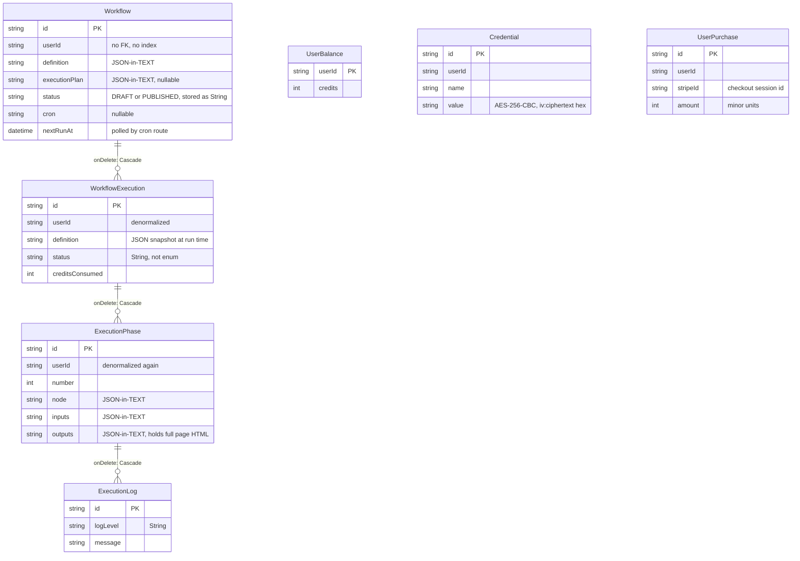

This is a [Next.js](https://nextjs.org) project bootstrapped with [`create-next-app`](https://nextjs.org/docs/app/api-reference/cli/create-next-app).

## Architecture

SynthScrape is a single Next.js 15 App Router deployment — no separate worker, no queue, no cache
layer. Everything (UI, server actions, API routes, and the Puppeteer scraping engine) runs inside
the same Node process. State lives in one PostgreSQL database reached through Prisma 7 with the
`pg` driver adapter (`src/lib/prisma.ts`). Identity is delegated to Clerk; payments to Stripe.

### Components as they actually exist

| Layer | Where | Notes |
| --- | --- | --- |
| Auth | `src/middleware.ts` | `clerkMiddleware`; `/`, `/sign-in*`, `/sign-up*`, `/api/webhooks/stripe` and **all** of `/api/workflows/*` are public routes |
| Mutations/queries | `actions/**` (`"use server"`) | Server Actions, not a REST API. Each re-checks `auth()` itself |
| HTTP endpoints | `src/app/api/**` | Only three: Stripe webhook, cron poller, workflow executor |
| Flow editor | `src/app/workflow/_components/**` | `@xyflow/react` canvas; graph serialized to a JSON string in `Workflow.definition` |
| Task/executor registries | `src/lib/workflow/task/registry.tsx`, `src/lib/workflow/executor/registry.ts` | Two parallel maps keyed by `TaskType` — one for UI metadata, one for runtime behaviour |
| Execution engine | `src/lib/workflow/executeWorkflow.ts` | In-process, sequential, `await`-driven; no queue, no retries |
| Browser automation | `src/lib/workflow/executor/*Executor.ts` | `puppeteer.launch()` in-process; one `Browser` + one `Page` per execution |
| Billing | `actions/billing/**`, `src/lib/stripe/**` | Stripe Checkout → webhook → `UserBalance.credits` |
| Secrets at rest | `src/lib/encryption.ts` | AES-256-CBC with a single `ENCRYPTION_KEY` |

### Flow 1 — workflow authoring and execution



Notes that the diagram encodes deliberately:

- The cron poller does **not** claim or advance `nextRunAt`; that only happens later inside
  `initializeWorkflowExecution` (`src/lib/workflow/executeWorkflow.ts:55`).
- `RunWorkflow` defers the engine with `after()` (`actions/workflows/runWorkflow.ts:98`),
  while `/api/workflows/execute` awaits it directly (`src/app/api/workflows/execute/route.ts:83`).
  Two different lifetimes for the same engine. The call was originally a bare unawaited promise,
  which worked on a long-lived local server and silently abandoned every run on serverless, where the
  instance is frozen once the response is sent.
- Phases execute strictly sequentially in the order Postgres returns them
  (`src/lib/workflow/executeWorkflow.ts:38`); the phase *numbers* produced by the planner are not
  used to parallelise anything at runtime.

### Flow 2 — credits and billing



### Data model

Six tables, no `User` table — Clerk's `userId` is a bare `String` column on five of them with no
foreign key and, as of this writing, **no `@@index`** anywhere in `prisma/schema.prisma`.



### Environment

Required at runtime (names only; see `.env`, which is git-ignored):
`DATABASE_URL`, `ENCRYPTION_KEY` (32-byte hex), `API_SECRET`, `NEXT_PUBLIC_APP_URL`,
`NEXT_PUBLIC_CLERK_PUBLISHABLE_KEY`, `CLERK_SECRET_KEY`, `STRIPE_SECRET_KEY`,
`STRIPE_WEBHOOK_SECRET`, and `STRIPE_{SMALL,MEDIUM,LARGE}_PACK_ID`.


## Getting Started

First, run the development server:

```bash
npm run dev
# or
yarn dev
# or
pnpm dev
# or
bun dev
```

Open [http://localhost:3000](http://localhost:3000) with your browser to see the result.

You can start editing the page by modifying `app/page.tsx`. The page auto-updates as you edit the file.

This project uses [`next/font`](https://nextjs.org/docs/app/building-your-application/optimizing/fonts) to automatically optimize and load [Geist](https://vercel.com/font), a new font family for Vercel.

## Learn More

To learn more about Next.js, take a look at the following resources:

- [Next.js Documentation](https://nextjs.org/docs) - learn about Next.js features and API.
- [Learn Next.js](https://nextjs.org/learn) - an interactive Next.js tutorial.

You can check out [the Next.js GitHub repository](https://github.com/vercel/next.js) - your feedback and contributions are welcome!

## Deploy on Vercel

The easiest way to deploy your Next.js app is to use the [Vercel Platform](https://vercel.com/new?utm_medium=default-template&filter=next.js&utm_source=create-next-app&utm_campaign=create-next-app-readme) from the creators of Next.js.

Check out our [Next.js deployment documentation](https://nextjs.org/docs/app/building-your-application/deploying) for more details.

streak maintain rehna chahiye
